# ___***IP-Adapter: Text Compatible Image Prompt Adapter for Text-to-Image Diffusion Models***___

<a href='https://ip-adapter.github.io'></a> 
<a href='https://arxiv.org/abs/2308.06721'></a> 
<a href='https://huggingface.co/h94/IP-Adapter'></a>
[](https://github.com/tencent-ailab/IP-Adapter/)


---


## Introduction

we present IP-Adapter, an effective and lightweight adapter to achieve image prompt capability for the pre-trained text-to-image diffusion models. An IP-Adapter with only 22M parameters can achieve comparable or even better performance to a fine-tuned image prompt model. IP-Adapter can be generalized not only to other custom models fine-tuned from the same base model, but also to controllable generation using existing controllable tools. Moreover, the image prompt can also work well with the text prompt to accomplish multimodal image generation.

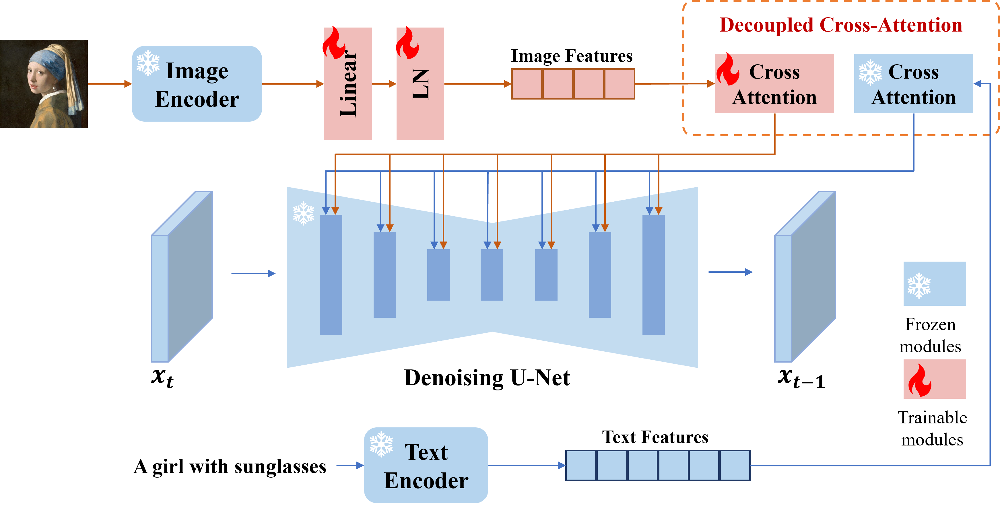

## Release
- [2023/11/10] 🔥 Add an updated version of IP-Adapter-Face. The demo is [here](ip_adapter-full-face_demo.ipynb).
- [2023/11/05] 🔥 Add text-to-image [demo](ip_adapter_t2i_demo.ipynb) with IP-Adapter and [Kandinsky 2.2 Prior](https://huggingface.co/kandinsky-community/kandinsky-2-2-prior)
- [2023/11/02] Support [safetensors](https://github.com/huggingface/safetensors)
- [2023/9/08] 🔥 Update a new version of IP-Adapter with SDXL_1.0. More information can be found [here](#sdxl_10).
- [2023/9/05] 🔥🔥🔥 IP-Adapter is supported in [WebUI](https://github.com/Mikubill/sd-webui-controlnet/discussions/2039) and [ComfyUI](https://github.com/laksjdjf/IPAdapter-ComfyUI) (or [ComfyUI_IPAdapter_plus](https://github.com/cubiq/ComfyUI_IPAdapter_plus)).
- [2023/8/30] 🔥 Add an IP-Adapter with face image as prompt. The demo is [here](ip_adapter-plus-face_demo.ipynb).
- [2023/8/29] 🔥 Release the training code.
- [2023/8/23] 🔥 Add code and models of IP-Adapter with fine-grained features. The demo is [here](ip_adapter-plus_demo.ipynb).
- [2023/8/18] 🔥 Add code and models for [SDXL 1.0](https://huggingface.co/stabilityai/stable-diffusion-xl-base-1.0). The demo is [here](ip_adapter_sdxl_demo.ipynb).
- [2023/8/16] 🔥 We release the code and models.


## Installation

```
# install latest diffusers
pip install diffusers==0.22.1

# install ip-adapter
pip install git+https://github.com/tencent-ailab/IP-Adapter.git

# download the models
cd IP-Adapter
git lfs install
git clone https://huggingface.co/h94/IP-Adapter
mv IP-Adapter/models models
mv IP-Adapter/sdxl_models sdxl_models

# then you can use the notebook
```

## Download Models

you can download models from [here](https://huggingface.co/h94/IP-Adapter). To run the demo, you should also download the following models:
- [runwayml/stable-diffusion-v1-5](https://huggingface.co/runwayml/stable-diffusion-v1-5)
- [stabilityai/sd-vae-ft-mse](https://huggingface.co/stabilityai/sd-vae-ft-mse)
- [SG161222/Realistic_Vision_V4.0_noVAE](https://huggingface.co/SG161222/Realistic_Vision_V4.0_noVAE)
- [ControlNet models](https://huggingface.co/lllyasviel)

## How to Use

### SD_1.5

- [**ip_adapter_demo**](ip_adapter_demo.ipynb): image variations, image-to-image, and inpainting with image prompt.
- [](https://colab.research.google.com/github/tencent-ailab/IP-Adapter/blob/main/ip_adapter_demo.ipynb) 

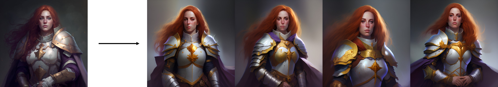


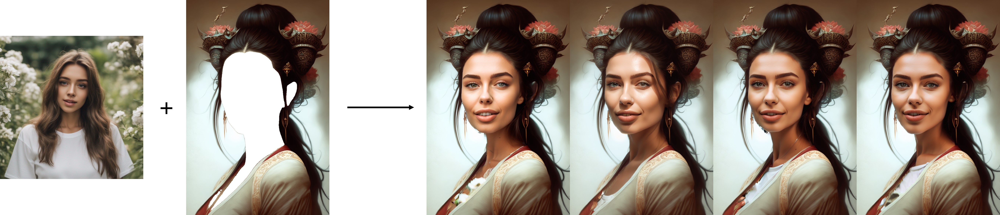

- [**ip_adapter_controlnet_demo**](ip_adapter_controlnet_demo_new.ipynb), [**ip_adapter_t2i-adapter**](ip_adapter_t2i-adapter_demo.ipynb): structural generation with image prompt.
- [](https://colab.research.google.com/github/tencent-ailab/IP-Adapter/blob/main/ip_adapter_controlnet_demo.ipynb) 

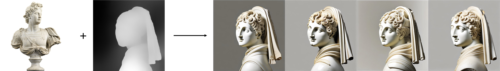
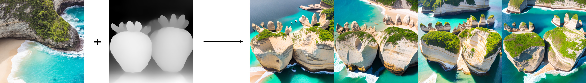

- [**ip_adapter_multimodal_prompts_demo**](ip_adapter_multimodal_prompts_demo.ipynb): generation with multimodal prompts.
- [](https://colab.research.google.com/github/tencent-ailab/IP-Adapter/blob/main/ip_adapter_multimodal_prompts_demo.ipynb) 

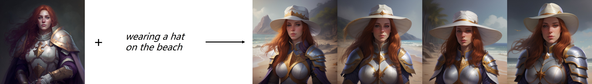

- [**ip_adapter-plus_demo**](ip_adapter-plus_demo.ipynb): the demo of IP-Adapter with fine-grained features.

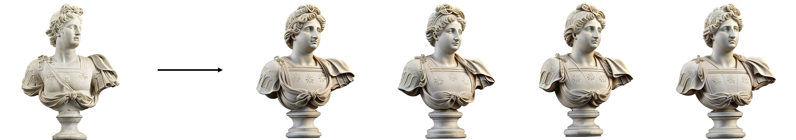
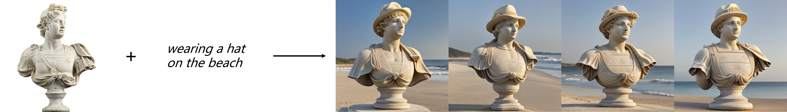

- [**ip_adapter-plus-face_demo**](ip_adapter-plus-face_demo.ipynb): generation with face image as prompt.

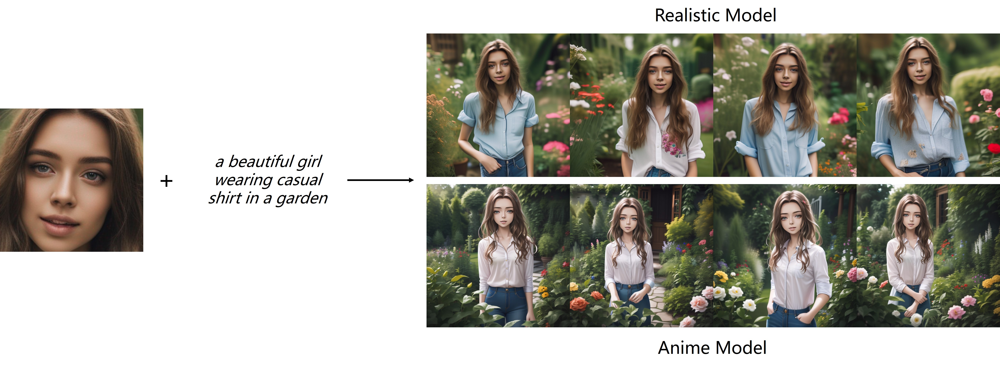

**Best Practice**
- If you only use the image prompt, you can set the `scale=1.0` and `text_prompt=""`(or some generic text prompts, e.g. "best quality", you can also use any negative text prompt). If you lower the `scale`, more diverse images can be generated, but they may not be as consistent with the image prompt.
- For multimodal prompts, you can adjust the `scale` to get the best results. In most cases, setting `scale=0.5` can get good results. For the version of SD 1.5, we recommend using community models to generate good images.

**IP-Adapter for non-square images**

As the image is center cropped in the default image processor of CLIP, IP-Adapter works best for square images. For the non square images, it will miss the information outside the center. But you can just resize to 224x224 for non-square images, the comparison is as follows:

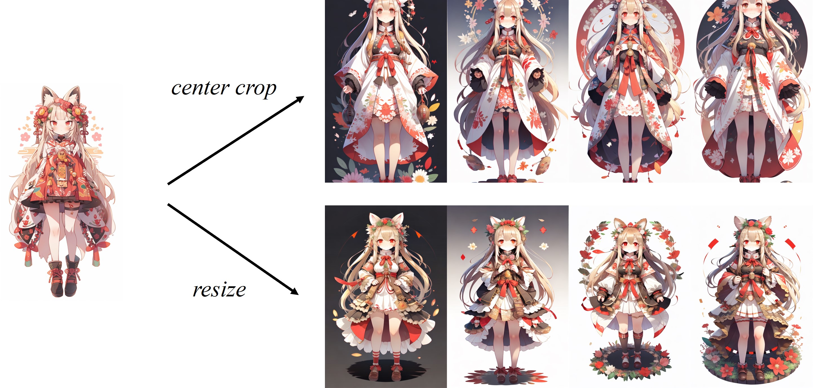

### SDXL_1.0

- [**ip_adapter_sdxl_demo**](ip_adapter_sdxl_demo.ipynb): image variations with image prompt.
- [**ip_adapter_sdxl_controlnet_demo**](ip_adapter_sdxl_controlnet_demo.ipynb): structural generation with image prompt.

The comparison of **IP-Adapter_XL** with [Reimagine XL](https://clipdrop.co/stable-diffusion-reimagine) is shown as follows:

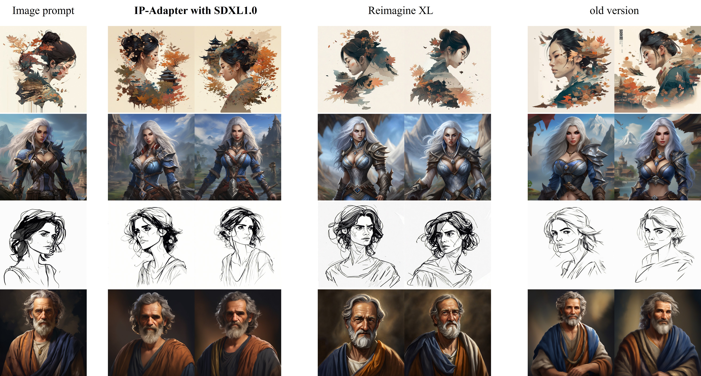

**Improvements in new version (2023.9.8)**:
- **Switch to CLIP-ViT-H**: we trained the new IP-Adapter with [OpenCLIP-ViT-H-14](https://huggingface.co/laion/CLIP-ViT-H-14-laion2B-s32B-b79K) instead of [OpenCLIP-ViT-bigG-14](https://huggingface.co/laion/CLIP-ViT-bigG-14-laion2B-39B-b160k). Although ViT-bigG is much larger than ViT-H, our experimental results did not find a significant difference, and the smaller model can reduce the memory usage in the inference phase.
- **A Faster and better training recipe**: In our previous version, training directly at a resolution of 1024x1024 proved to be highly inefficient. However, in the new version, we have implemented a more effective two-stage training strategy. Firstly, we perform pre-training at a resolution of 512x512. Then, we employ a multi-scale strategy for fine-tuning. (Maybe this training strategy can also be used to speed up the training of controlnet).

## How to Train
For training, you should install [accelerate](https://github.com/huggingface/accelerate) and make your own dataset into a json file.

```
accelerate launch --num_processes 8 --multi_gpu --mixed_precision "fp16" \
  tutorial_train.py \
  --pretrained_model_name_or_path="runwayml/stable-diffusion-v1-5/" \
  --image_encoder_path="{image_encoder_path}" \
  --data_json_file="{data.json}" \
  --data_root_path="{image_path}" \
  --mixed_precision="fp16" \
  --resolution=512 \
  --train_batch_size=8 \
  --dataloader_num_workers=4 \
  --learning_rate=1e-04 \
  --weight_decay=0.01 \
  --output_dir="{output_dir}" \
  --save_steps=10000
```


## Third-party Usage
- [IP-Adapter for WebUI](https://github.com/Mikubill/sd-webui-controlnet) [[release notes](https://github.com/Mikubill/sd-webui-controlnet/discussions/2039)]
- IP-Adapter for ComfyUI [[IPAdapter-ComfyUI](https://github.com/laksjdjf/IPAdapter-ComfyUI) or [ComfyUI_IPAdapter_plus](https://github.com/cubiq/ComfyUI_IPAdapter_plus)]
- [IP-Adapter for InvokeAI](https://github.com/invoke-ai/InvokeAI) [[release notes](https://github.com/invoke-ai/InvokeAI/releases/tag/v3.2.0)]
- [IP-Adapter for AnimateDiff prompt travel](https://github.com/s9roll7/animatediff-cli-prompt-travel)
- [Diffusers_IPAdapter](https://github.com/cubiq/Diffusers_IPAdapter): more features such as supporting multiple input images

## Disclaimer

This project strives to positively impact the domain of AI-driven image generation. Users are granted the freedom to create images using this tool, but they are expected to comply with local laws and utilize it in a responsible manner. **The developers do not assume any responsibility for potential misuse by users.**

## Citation
If you find IP-Adapter useful for your research and applications, please cite using this BibTeX:
```bibtex
@article{ye2023ip-adapter,
  title={IP-Adapter: Text Compatible Image Prompt Adapter for Text-to-Image Diffusion Models},
  author={Ye, Hu and Zhang, Jun and Liu, Sibo and Han, Xiao and Yang, Wei},
  booktitle={arXiv preprint arxiv:2308.06721},
  year={2023}
}
```
